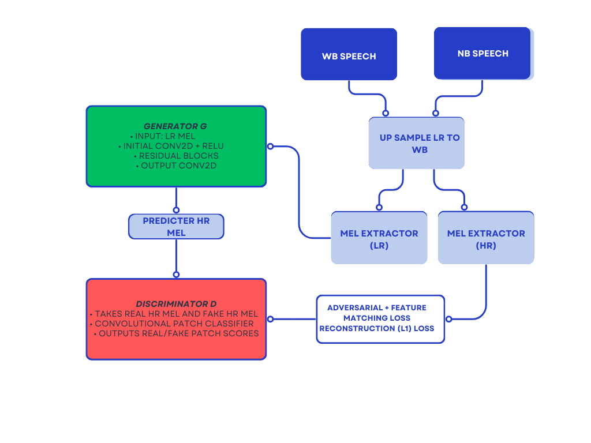
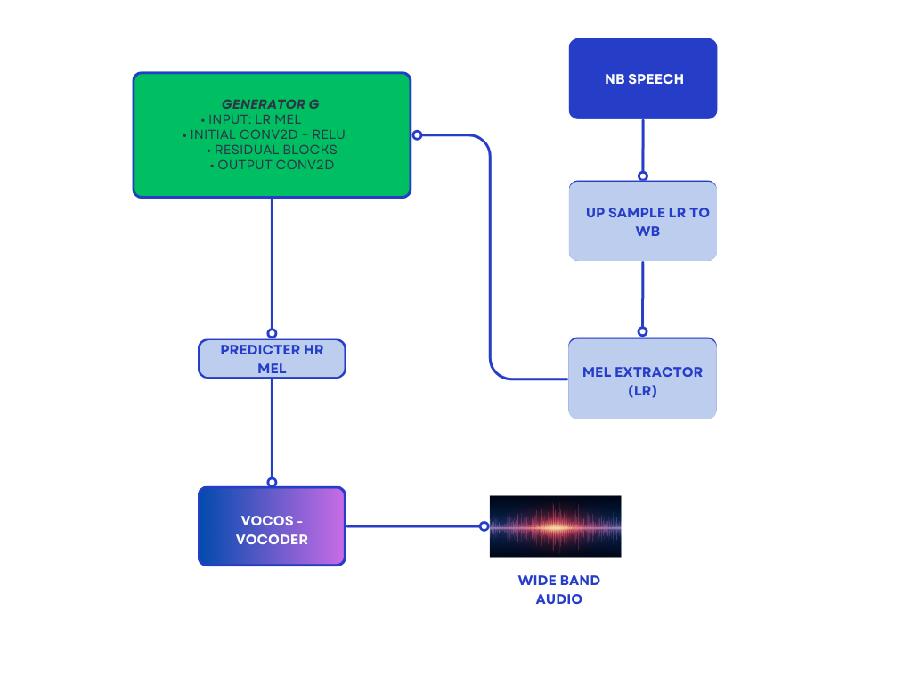

# AudioSR-GAN: Speech Bandwidth Extension (8 kHz → 22.05 kHz)

## Overview

This project performs **Audio Super‑Resolution (Speech Bandwidth Extension)**, transforming **8 kHz narrow‑band audio** into **22.05 kHz wide‑band audio** using:

* A **CNN‑based generator** (SRResNet‑style)
* A **PatchGAN discriminator** for realism
* **Mel‑spectrogram domain training**
* **neural vocoders** (Vocos) for waveform reconstruction

---

## Full Workflow (High‑Level)

```
  Low‑Resolution Audio (8 kHz)
            │
            ▼
     Upsample to 22.05 kHz
            │
            ▼
   Convert to Log‑Mel Spectrogram
            │
            ▼
   ┌──────────────────────────────┐
   │   CNN / SRResNet Generator   │
   └──────────────────────────────┘
            │
            ▼
   Predicted High‑Resolution Mel
            │
            ▼
   Neural Vocoder (HiFi‑GAN/Vocos)
            │
            ▼
  Final Reconstructed 22.05 kHz Audio
```

##  Model Architecture

### Training Pipeline


### Inference Pipeline



# Mel configuration used across training, inference, and vocoder reconstruction
```
Sample rate: 22,050 Hz (fixed requirement — mel extractor MUST match vocoder SR)

n_mels: 80 (required by vocos-mel-22kHz)

n_fft: 1024 (internally forced)

Hop length: 256 (internally forced)

Window length: 1024 (internally forced)

Padding mode: 'same' (ensures correct temporal alignment)

Mel scale: HTK mel scale (default in extractor)

Log mel: apply_log = False → linear mel, because Vocos expects linear mel inputs

✔ Why these configs matter

80 mel bins are standard for speech models and required for the Vocos vocoder you use.

apply_log = False prevents incompatibility with vocos‑mel‑22kHz (which internally applies its own log processing).

Fixing n_fft = 1024 and hop = 256 gives a 12 ms hop, a sweet spot between temporal detail and GAN stability.

This consistent mel configuration ensures:

Stable generator training

Proper alignment between LR/HR mel pairs

Correct conditioning for both HiFi‑GAN and Vocos vocoders strike a balance between time–frequency resolution, GAN stability, and compatibility with HiFi‑GAN/Vocos vocoders. The hop length of 256 ensures smooth reconstruction and avoids phase artifacts after vocoder synthesis. The 128‑mel dimension provides enough resolution for high-frequency detail without making training unstable or memory-heavy.
```
---

##  1. Dataset Preparation (8 kHz → 22.05 kHz)

### **Generate HR (22,050 Hz) & LR (8,000 Hz) pairs**

```bash
python -m  src.dataset.make_low_sr_dataset --in_root archive
```
#### **Check Bandwidth of dataset**
```
python -m  src.dataset.check_bw --input data/hr/p225_001.wav 
python -m  src.dataset.audio_properties data/hr/p225_001.wav 
```
---

##  2. Train the CNN Baseline Model (Or the CNN-GAN model in Step 3 )

```bash
python -m src.train --dataset_dir data --out_dir checkpoints --batch_size 32 --epochs 100
```

---

##  3. Train the GAN Model

```bash
python -m src.train_gan --dataset_dir data --out_dir checkpoints_gan --batch_size 32 --epochs 100
```

---

##  4. Standard Inference (Generator Only)

### **A. Run inference on entire HR directory**

```bash
python -m src.infer --generator_ckpt checkpoints_gan/generator_final.pt --output_dir outputs_gan
```

### **B. Limit inference to N files**

```bash
python -m src.infer --generator_ckpt checkpoints_gan/generator_final.pt --max_files 20 --output_dir outputs_gan
```

### **C. Inference on a single LR file**

```bash
python -m src.infer --input_wav data/low_sr/p225_001.wav --generator_ckpt checkpoints/generator_final.pt --hr_dir data/hr --output_dir outputs_gan
```

---

##  5. Inference (Using Griffin Lim Vocoder)**

```bash
python -m src.infer --input_wav data/low_sr/p225_001.wav --generator_ckpt checkpoints/generator_final.pt --hr_dir data/hr --output_dir outputs --vocoder griffin
```

---

##  6. Quick Testing Utilities

```bash
python -m src.infer --input_wav data/low_sr/p225_001.wav
python -m src.infer --max_files 5
```

---

##  7. Evaluation

### **Evaluate SR quality (STOI, PESQ, LSD, SNR, MSE)**

```bash
python -m src.utils.eval --sr_file outputs_gan/p225_001_sr.wav
```

### **Evaluate Vocoder Reconstructions to Test Vocoder Quality**

```bash
python -m src.utils.vocoder_eval --hr_dir data/test/ --max_files 5 --save_recon
```

---

##  Block Diagram (Mel‑Domain GAN)

```
   ┌───────────────────────────────────────────────┐
   │                 Low‑SR Mel (Input)            │
   └───────────────────────────────────────────────┘
                        │
                        ▼
          ┌──────────────────────────────┐
          │   SRResNet Generator (G)     │
          └──────────────────────────────┘
                        │
                        ▼
           Predicted High‑Resolution Mel
                        │
                        ▼
     ┌────────────────────────────────────────────┐
     │ PatchGAN Discriminator (D) – optional GAN  │
     └────────────────────────────────────────────┘
                        │
                        ▼
                 Adversarial Loss
```

---

##  Future Improvements

* Diffusion‑based vocoders
* Multi‑speaker embeddings
* Perceptual losses (wav2vec2 / Encodec)
* Large‑scale dataset training (VCTK, LibriSpeech)
